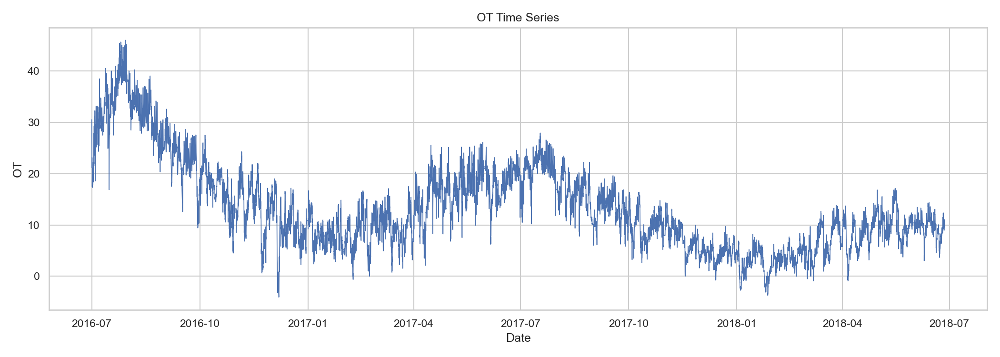
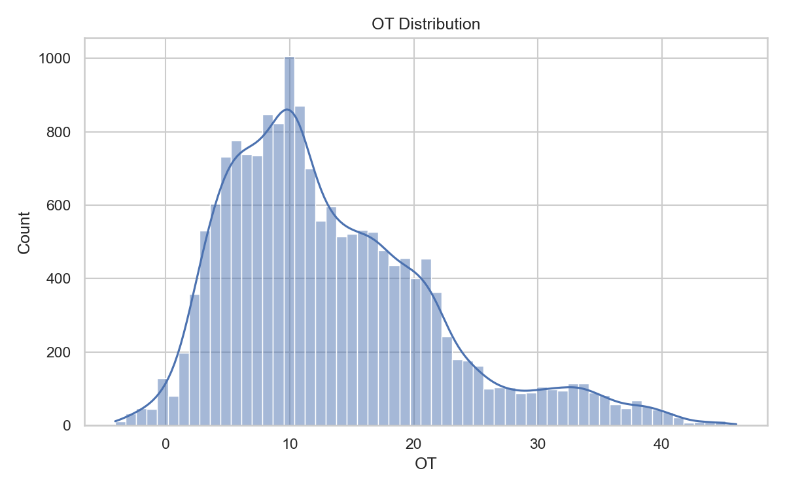
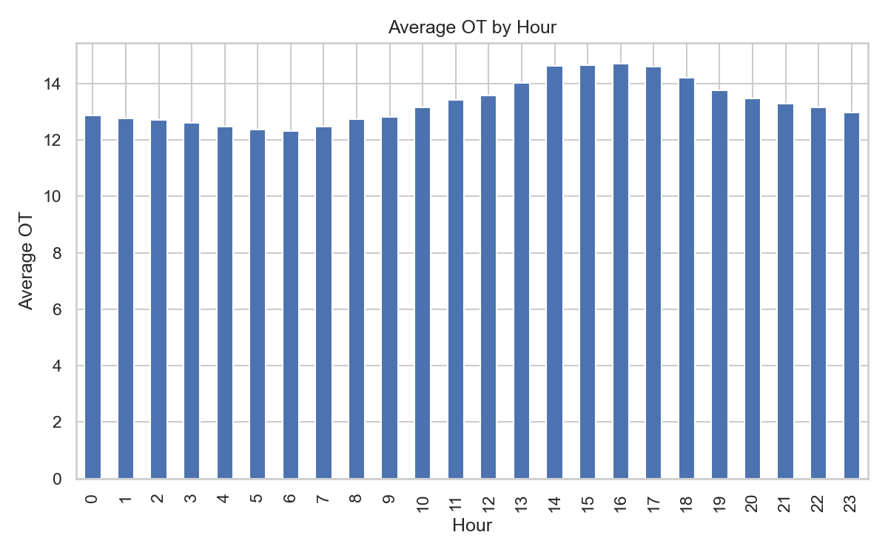
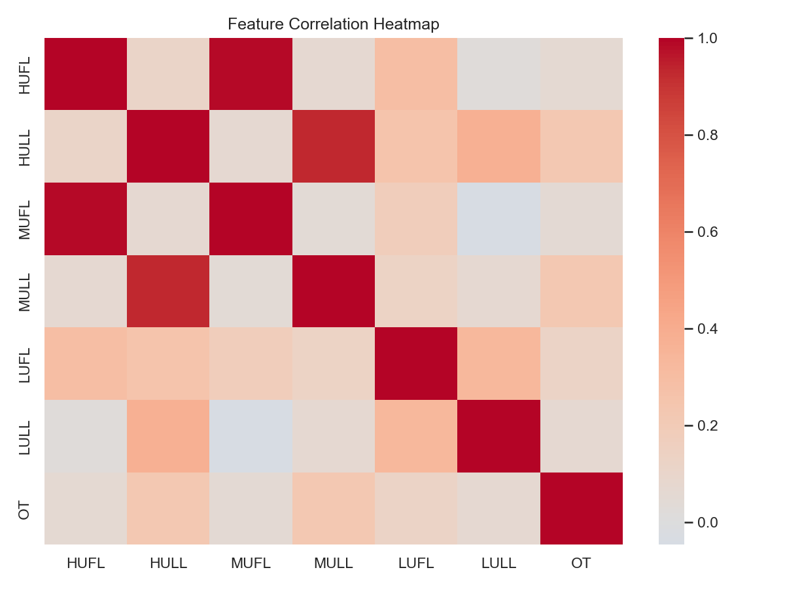
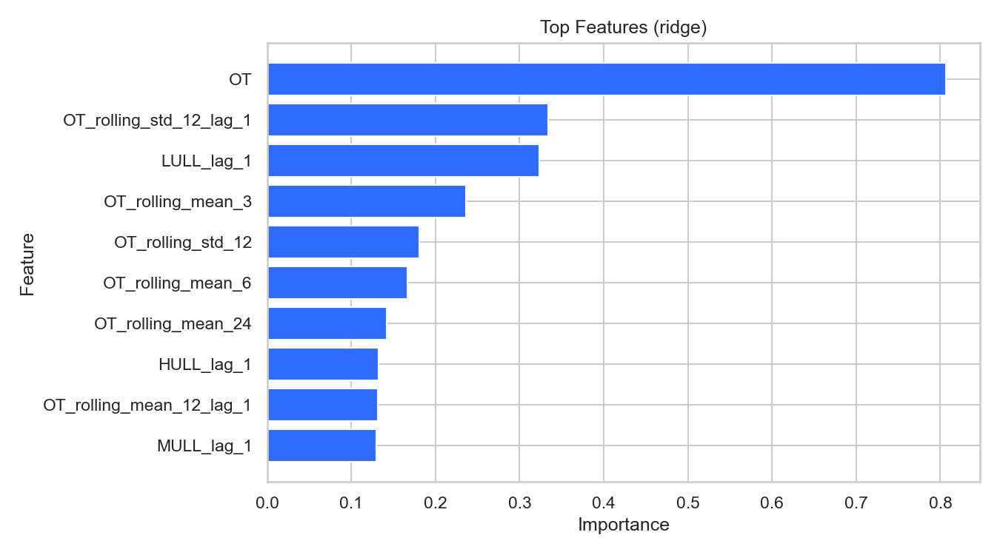
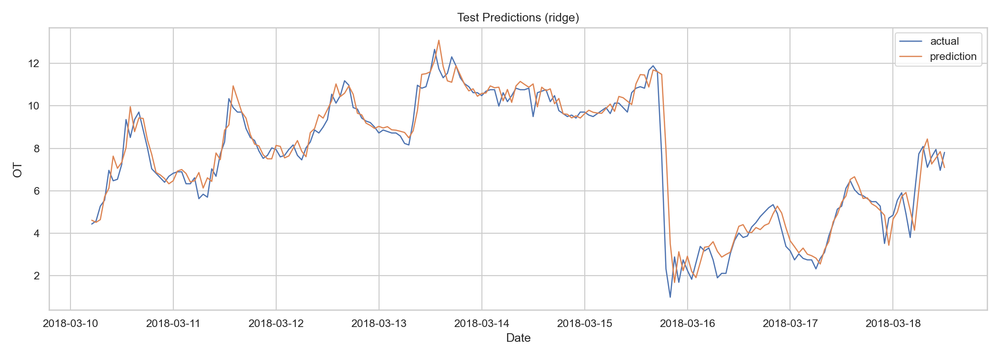

---
marp: true
theme: default
paginate: true
size: 16:9
style: |
  section {
    font-family: "Yu Gothic", "Meiryo", sans-serif;
    color: #1f2937;
    background: #f8fbff;
    padding: 14px 40px 12px 40px;
  }
  h1 {
    margin: 0 0 4px 0;
    font-size: 22px;
    color: #0f172a;
  }
  .message {
    margin: 0 0 6px 0;
    padding: 6px 10px;
    font-size: 24px;
    font-weight: 700;
    line-height: 1.3;
    color: #0f172a;
    background: #e8f0ff;
    border-left: 7px solid #2563eb;
  }
  .body {
    font-size: 15px;
    line-height: 1.35;
  }
  .cols {
    display: flex;
    gap: 16px;
    align-items: flex-start;
  }
  .col {
    flex: 1;
  }
  .box {
    background: #ffffff;
    border: 1px solid #d7e3f4;
    border-radius: 10px;
    padding: 8px 12px;
    box-sizing: border-box;
  }
  .box h2 {
    margin: 0 0 4px 0;
    font-size: 16px;
    color: #1d4ed8;
  }
  .summary-row {
    display: flex;
    gap: 18px;
    margin-top: 14px;
  }
  .summary-box {
    flex: 1;
    background: #ffffff;
    border: 1px solid #d7e3f4;
    border-radius: 12px;
    padding: 12px 16px;
    box-sizing: border-box;
  }
  .summary-box h2 {
    margin: 0 0 6px 0;
    font-size: 19px;
    color: #1d4ed8;
  }
  .summary-box ul {
    margin: 0.25em 0 0 1em;
    padding-left: 0.2em;
    font-size: 17px;
    line-height: 1.45;
  }
  .summary-box li {
    margin: 0.24em 0;
  }
  .scope-row {
    display: flex;
    gap: 18px;
    margin-top: 12px;
  }
  .scope-box {
    flex: 1;
    background: #ffffff;
    border: 1px solid #d7e3f4;
    border-radius: 12px;
    padding: 12px 16px;
    box-sizing: border-box;
  }
  .scope-box h2 {
    margin: 0 0 6px 0;
    font-size: 19px;
    color: #1d4ed8;
  }
  .scope-box ul {
    margin: 0.25em 0 0 1em;
    padding-left: 0.2em;
    font-size: 17px;
    line-height: 1.45;
  }
  .scope-box li {
    margin: 0.24em 0;
  }
  .scope-note {
    margin-top: 8px;
    font-size: 16px;
    line-height: 1.45;
    color: #334155;
  }
  .overview-grid {
    display: grid;
    grid-template-columns: repeat(2, 1fr);
    gap: 12px;
  }
  .overview-card {
    background: #ffffff;
    border: 1px solid #d7e3f4;
    border-radius: 12px;
    padding: 10px 12px;
  }
  .overview-card .label {
    font-size: 15px;
    color: #64748b;
  }
  .overview-card .value {
    margin-top: 4px;
    font-size: 26px;
    font-weight: 800;
    color: #0f172a;
  }
  .overview-card .value.smallv {
    font-size: 18px;
  }
  .overview-note {
    margin-top: 12px;
    background: #ffffff;
    border: 1px solid #d7e3f4;
    border-radius: 12px;
    padding: 10px 14px;
    font-size: 17px;
    line-height: 1.45;
  }
  .signal-box {
    background: #ffffff;
    border: 1px solid #d7e3f4;
    border-radius: 12px;
    padding: 12px 16px;
    box-sizing: border-box;
  }
  .signal-box h2 {
    margin: 0 0 6px 0;
    font-size: 19px;
    color: #1d4ed8;
  }
  .signal-box ul {
    margin: 0.25em 0 0 1em;
    padding-left: 0.2em;
    font-size: 17px;
    line-height: 1.45;
  }
  .signal-box li {
    margin: 0.24em 0;
  }
  .signal-note {
    margin-top: 10px;
    font-size: 16px;
    line-height: 1.45;
    color: #334155;
  }
  .feature-box {
    background: #ffffff;
    border: 1px solid #d7e3f4;
    border-radius: 12px;
    padding: 12px 16px;
    box-sizing: border-box;
  }
  .feature-box h2 {
    margin: 0 0 6px 0;
    font-size: 19px;
    color: #1d4ed8;
  }
  .feature-box ul {
    margin: 0.25em 0 0 1em;
    padding-left: 0.2em;
    font-size: 17px;
    line-height: 1.45;
  }
  .feature-box li {
    margin: 0.24em 0;
  }
  .feature-note {
    margin-top: 10px;
    font-size: 16px;
    line-height: 1.45;
    color: #334155;
  }
  .feature-stack {
    display: flex;
    flex-direction: column;
    gap: 12px;
  }
  .matrix-box {
    background: #ffffff;
    border: 1px solid #d7e3f4;
    border-radius: 12px;
    padding: 12px 16px;
    box-sizing: border-box;
  }
  .matrix-box h2 {
    margin: 0 0 6px 0;
    font-size: 19px;
    color: #1d4ed8;
  }
  .matrix-box ul {
    margin: 0.25em 0 0 1em;
    padding-left: 0.2em;
    font-size: 17px;
    line-height: 1.45;
  }
  .matrix-box li {
    margin: 0.24em 0;
  }
  .matrix-note {
    margin-top: 10px;
    font-size: 16px;
    line-height: 1.45;
    color: #334155;
  }
  .stack {
    display: flex;
    flex-direction: column;
    gap: 12px;
  }
  .fit-chart {
    flex: 1.35;
  }
  .fit-side {
    flex: 0.9;
  }
  .step-row {
    display: grid;
    grid-template-columns: 1fr 0.35fr 1fr 0.35fr 1fr 0.35fr 1fr 0.35fr 1fr 0.35fr 1fr;
    gap: 6px;
    margin-top: 8px;
    align-items: center;
  }
  .step {
    background: #ffffff;
    border: 1px solid #d7e3f4;
    border-radius: 10px;
    padding: 10px 8px;
    text-align: center;
    font-size: 15px;
    line-height: 1.35;
    font-weight: 700;
    color: #0f172a;
  }
  .step-arrow {
    text-align: center;
    font-size: 24px;
    font-weight: 800;
    color: #2563eb;
  }
  .matrix-table {
    width: 100%;
    border-collapse: collapse;
    font-size: 15px;
    background: #ffffff;
  }
  .matrix-table th,
  .matrix-table td {
    border: 1px solid #d7e3f4;
    padding: 8px 10px;
    vertical-align: top;
  }
  .matrix-table th {
    background: #e8f0ff;
    color: #0f172a;
  }
  .roadmap {
    display: grid;
    grid-template-columns: repeat(4, 1fr);
    gap: 12px;
    margin-top: 8px;
  }
  .roadmap-card {
    background: #ffffff;
    border: 1px solid #d7e3f4;
    border-radius: 12px;
    padding: 12px 14px;
  }
  .roadmap-card .phase {
    font-size: 13px;
    color: #64748b;
  }
  .roadmap-card .title {
    margin-top: 4px;
    font-size: 18px;
    font-weight: 800;
    color: #0f172a;
  }
  .roadmap-card .desc {
    margin-top: 6px;
    font-size: 15px;
    line-height: 1.4;
    color: #334155;
  }
  .body ul {
    margin: 0.2em 0 0 1em;
    padding-left: 0.2em;
  }
  .body li {
    margin: 0.14em 0;
  }
  .metric-grid {
    display: grid;
    grid-template-columns: repeat(4, 1fr);
    gap: 10px;
    margin-top: 2px;
  }
  .metric-grid.two {
    grid-template-columns: repeat(2, 1fr);
  }
  .metric {
    background: #ffffff;
    border: 1px solid #d7e3f4;
    border-radius: 10px;
    padding: 8px 10px;
  }
  .metric .label {
    font-size: 12px;
    color: #64748b;
  }
  .metric .value {
    margin-top: 4px;
    font-size: 24px;
    font-weight: 800;
    color: #0f172a;
  }
  .metric .value.smallv {
    font-size: 16px;
  }
  .caption {
    margin-top: 4px;
    font-size: 14px;
    line-height: 1.4;
    color: #475569;
  }
  table {
    width: 100%;
    border-collapse: collapse;
    font-size: 13px;
    background: #ffffff;
  }
  th, td {
    border: 1px solid #d7e3f4;
    padding: 6px 7px;
    text-align: left;
  }
  th {
    background: #e8f0ff;
    color: #0f172a;
  }
  .lead {
    background:
      radial-gradient(circle at top right, rgba(96, 165, 250, 0.30), transparent 24%),
      radial-gradient(circle at bottom left, rgba(37, 99, 235, 0.16), transparent 28%),
      linear-gradient(135deg, #cfe3ff 0%, #e7f0ff 38%, #f7fbff 100%);
  }
  .lead .title {
    margin-top: 6px;
    display: inline-block;
    padding: 6px 10px;
    border-radius: 999px;
    background: rgba(255, 255, 255, 0.82);
    border: 1px solid #bfdbfe;
    font-size: 18px;
    letter-spacing: 0.08em;
    font-weight: 800;
    line-height: 1.2;
    color: #2563eb;
  }
  .lead .hero {
    margin-top: 24px;
    background: linear-gradient(135deg, rgba(15, 23, 42, 0.98) 0%, rgba(30, 41, 59, 0.96) 100%);
    border: 1px solid rgba(59, 130, 246, 0.35);
    border-radius: 20px;
    padding: 26px 28px;
    box-shadow: 0 18px 36px rgba(15, 23, 42, 0.24);
  }
  .lead .hero-title {
    font-size: 32px;
    font-weight: 800;
    line-height: 1.28;
    color: #f8fafc;
  }
  .lead .hero-sub {
    margin-top: 12px;
    font-size: 17px;
    line-height: 1.55;
    color: #cbd5e1;
  }
  .lead .support {
    margin-top: 18px;
    background: rgba(255, 255, 255, 0.92);
    border: 1px solid #93c5fd;
    border-radius: 14px;
    padding: 16px 18px;
    font-size: 16px;
    line-height: 1.55;
    color: #1e293b;
  }
footer: "Athena OT Forecast PoC"
---

<!-- _class: lead -->

Athena OT Forecast PoC

  
ETTh1 を用いた OT 1時間先予測 PoC 報告

  
データ概要、予測精度、成立根拠、次フェーズ論点を整理した報告資料

対象: ETTh1 / 目的変数: OT / 予測対象: 1時間先

---

# エグゼクティブサマリー

OT の1時間先予測は PoC として成立し、次フェーズは Ridge を基準に一般化性能を検証すべきである

## 重要ポイント

- Ridge は test で `MAE 0.435`, `R2 0.948` を記録し、1時間先予測として高い精度を示した
- 直前値ベースライン `MAE 0.650` に対して約 `33%` 改善しており、PoC の成立性は高い
- tree ensemble も良好だが、Ridge / Linear Regression を上回る改善幅は小さい
- 現時点の主要論点は、精度向上そのものよりも汎化性能と再現性の確認である

## 推奨判断

- `1h horizon` は追加投資に値する精度水準であり、次フェーズへ進める判断が妥当である
- 次段階の基準モデルは Ridge とし、`6h / 24h horizon` と rolling backtest で一般化性能を検証する
- 追加モデルは Ridge を基準線として比較し、複雑性に見合う改善がある場合のみ採用を検討する

---

# Scope And Design

今回の PoC では、時刻 T までの情報のみを用いて、1時間先の OT を予測できるかを検証した。

  
ETTh1 データ読込

  
→

  
EDA 品質確認

  
→

  
特徴量作成

  
→

  
時系列分割

  
→

  
モデル比較

  
→

  
性能評価

## 検証範囲

- 目的変数は `OT`
- 予測対象は `1時間先`
- データ分割は `train 70% / valid 15% / test 15%`

時刻 T までに観測できる情報のみを使い、T+1 の OT を予測する設定で検証している。

## 評価指標

- `MAE`
- `RMSE`
- `R2`
- `sMAPE`

誤差の大きさ、外れ値への感度、説明力、相対誤差をそれぞれ確認し、単一指標に依存しない評価にしている。

---

# Data Overview

データ品質に大きな問題はなく、短期予測の PoC を進める前提は満たしている

  

データ件数

17,420

  

欠損値件数

0

  

対象期間

2016-07 から 2018-06

  

OT の標準偏差

8.57

長期トレンドと周期性が共存しており、短期予測に必要な自己相関も確認できる。欠損値はなく、PoC を進めるための前処理負荷は小さい。

---

# Distribution And Seasonality

分布と時刻依存パターンの両方が確認でき、calendar feature を入れる妥当性がある

OT の値が全期間でどのように分布しているかを示したヒストグラム。値の広がりや偏り、外れ値の有無を確認するための図。

1日の各時刻ごとに OT の平均値を集計した棒グラフ。時間帯による水準差、すなわち日内パターンの有無を確認するための図。

---

# Cross-Feature Signal

cross-feature 相関は中程度だが、自己回帰特徴と組み合わせると予測に必要なシグナルを構成できる

各センサ間の相関係数を色の濃さで表したヒートマップ。OT と他センサの線形な関係の強さを俯瞰するための図。

## 主なシグナル

- `HULL` と `OT` の相関は `0.22`
- `MULL` と `OT` の相関は `0.22`
- `LUFL` と `OT` の相関は `0.12`
- ただし、最も強い予測シグナルは `OT` 自身の lag / rolling 特徴量にある

この図から、OT は他センサとも一定の関係を持つが、相関の強さは全体として中程度にとどまることが分かる。つまり、他センサの値だけで予測するのではなく、OT の過去値や rolling 統計量を中心に据え、他センサを補助情報として加える設計が妥当である。

---

# Feature Engineering

予測性能を支えているのは、OT の lag と rolling 統計量である

## 使用した特徴量

- カレンダー特徴量
- `OT` のラグ特徴量
- 移動平均と移動標準偏差
- 他センサの1時点ラグ

時間帯や曜日の違いを表す情報、OT の直近の履歴、短期的な変動の大きさ、関連センサの直前値を組み合わせている。

## 補足

1時間先予測では、将来の値を直接決めるのは直近の OT の動きであることが多い。そのため、calendar 特徴だけでなく、lag や rolling といった時系列の履歴情報を厚めに入れる設計にしている。

特徴量重要度を見ると、短期の lag と rolling 系が上位を占めており、直近履歴の寄与が大きいことが分かる。

---

# Experiment Matrix

baseline を含む軽量なモデル群で、意思決定に十分な性能差が確認できた

## 比較したモデル

- 平均値ベースライン
- 直前値ベースライン
- 線形回帰
- Ridge 回帰
- Random Forest
- Extra Trees
- HistGradientBoosting

まずは単純な基準モデルと比較し、そのうえで線形モデルと木系モデルのどちらがこの課題に適しているかを確認している。

<table class="matrix-table">
  <thead>
    <tr>
      <th>比較カテゴリ</th>
      <th>モデル</th>
      <th>見るポイント</th>
    </tr>
  </thead>
  <tbody>
    <tr>
      <td>基準モデル</td>
      <td>平均値, 直前値</td>
      <td>学習モデルを使う価値があるか</td>
    </tr>
    <tr>
      <td>線形モデル</td>
      <td>線形回帰, Ridge</td>
      <td>シンプルな構造で十分か</td>
    </tr>
    <tr>
      <td>木系モデル</td>
      <td>RF, Extra Trees, HGB</td>
      <td>複雑化に見合う改善があるか</td>
    </tr>
  </tbody>
</table>

複雑なモデルを先に選ぶのではなく、単純なモデルから順に比較して、精度と実装容易性のバランスが最も良い候補を見つける構成にしている。

---

# Model Comparison

1時間 horizon では Ridge / Linear Regression が最良で、tree ensemble の追加複雑性は利益が小さい

| モデル | MAE | RMSE | R2 |
|---|---:|---:|---:|
| Ridge | 0.435 | 0.645 | 0.948 |
| 線形回帰 | 0.435 | 0.645 | 0.948 |
| Extra Trees | 0.440 | 0.657 | 0.946 |
| HistGradientBoosting | 0.443 | 0.652 | 0.947 |
| Random Forest | 0.445 | 0.652 | 0.947 |
| 直前値ベースライン | 0.650 | 0.947 | 0.888 |

## 結果の読み方

- Ridge と線形回帰はほぼ同等の性能で、1時間先予測では線形な関係でも十分に高精度である
- Extra Trees、HistGradientBoosting、Random Forest も良好だが、Ridge を明確に上回るほどの差は出ていない
- 直前値ベースラインとの差は大きく、単に「前の値を使うだけ」よりも学習モデルを使う価値がある

この結果から、現時点では複雑なモデルを採用するよりも、解釈しやすく運用しやすい Ridge を基準モデルとして使うのが合理的である。精度差が小さい以上、次に重視すべきはモデルの複雑さよりも、複数期間で見たときの安定性や汎化性能である。

---

# Prediction Fit

Best model は実測の短期変動に概ね追随しており、1時間先予測として実用的な形状を示す

テスト期間における実測値と予測値の推移を重ねて表示した図。予測がトレンドや短期変動にどの程度追随できているかを確認するための図。

## この図から分かること

- 予測線は実測値の大きな流れに概ね沿っており、1時間先の短期予測としては良好に追随している
- 一方で、急激な上昇や下降が起きる局面ではズレが大きくなる場面もあり、誤差は主に変化点周辺に集中している
- これは短期時系列予測でよく見られる挙動であり、モデルが平均的な動きは捉えられている一方、急変の先読みには限界があることを示している

## 実務上の示唆

この水準であれば、監視やアラート補助、将来値の目安提示といった用途では十分に有望である。一方で、制御判断のように急変時の外しが直接リスクにつながる用途では、追加の安全性確認や異常時の補助ロジックが必要になる。

---

# Recommendation

次フェーズは、Ridge を基準モデルとして「適用範囲」と「安定性」を確認する検証へ進むべきである

  

    
現在地

    
1時間先 PoC

    
Ridge が最良。PoC の成立性を確認。

  

  

    
Step 1

    
適用範囲の確認

    
6時間先、24時間先でも精度優位が続くかを見る。

  

  

    
Step 2

    
安定性検証

    
rolling backtest で時期をまたいだ再現性を確認する。

  

  

    
Step 3

    
実運用検証

    
追加モデル比較と運用条件模擬で実用性を評価する。

  

## 次フェーズで確認すること

- `6時間先` と `24時間先` でも baseline 超過が続くか
- 時期が変わっても性能が大きく崩れないか
- より複雑なモデルを使うだけの改善があるか
- 欠損や遅延を含む運用条件でも実用に耐えるか

今回の PoC は 1時間先予測としては有望である。次に重要なのは、精度をさらに少し上げることではなく、適用範囲を広げても安定して使えるかを確認することである。

